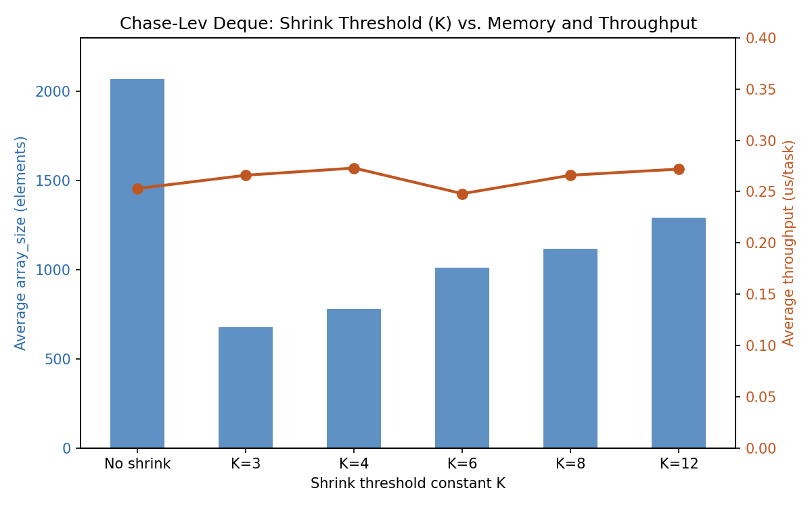

# Chase-Lev Deque: `lastTop` Caching Optimization — Benchmark Results

## What was tested

cited directly from the paper:
Unlike the original ABP algorithm, the new algorithm requires reading top on every execution of the pushBottom
operation. This may result in more data-cache misses compared to the original algorithm (recall that unlike bottom,
top is modified by all processes).
The frequency of accesses to the top variable can be significantly reduced, by keeping a local upper bound on the
size of the deque, and only read top when the upper bound indicates that an array expansion may be necessary. Such a
local upper bound can be easily achieved by saving the last value of top read in a local variable, and using this variable to compute the size of the deque (instead of the real value of top). Because top is never decremented, the real size of the deque can only be smaller than the one calculated using this local variable.

This was implemented by using a non atomic variable `lastTop`. It is updated in these steps:
1) Right after reading `top` in `popBottom`
2) Right after `cas` in `popBottom`
3) There is an additional added check if `lastTop` indicates the the array needs to grow. There, `top` is read and `lastTop` is updated.

## Test setup

- **Hardware**: WSL2 (Ubuntu), 16 logical cores (`nproc`)
- **Compiler**: g++, `-pthread`
- **Workload**: single owner thread pushing sequential `int` tasks; N thief threads
  concurrently calling `steal()`
- **Correctness check**: every run verified 0 duplicates and 0 missing tasks
- **Metric**: wall-clock time for the owner's full push loop, via `std::chrono`
- **Methodology**: 50 runs per configuration; first 5 runs of each set discarded as
  warm-up noise; median reported (median chosen over mean because a handful of runs
  in every set showed OS-scheduling-induced spikes 2–3x the typical value — median is
  far less sensitive to those outliers than the mean)

## Results

### Configuration 1: 4 thief threads, 10,000 tasks

| Version | Median (50 runs, first 5 dropped) | us/task |
|---|---|---|
| Uncached (`top.load()` every push) | 4,590 us | 0.459 |
| Cached (`lastTop`) | 4,370 us | 0.437 |

**Cached version: ~4.8% faster.**

### Configuration 2: 12 thief threads, 100,000 tasks

| Version | Run | Median (50 runs, first 5 dropped) |
|---|---|---|
| Uncached | Run 1 | 83,568 us |
| Uncached | Run 2 | 83,464 us |
| Cached | Run 1 | 82,000 us |
| Cached | Run 2 | 82,699 us |

**Cached version: ~1–2.5% faster** — consistently below both uncached runs across
repeated trials, but a noticeably smaller margin than at lower contention.

## Interpretation

The optimization produces a real, directionally consistent speedup in every
configuration tested — cached never came out slower than uncached in any run — but
the magnitude shrinks as thread count and task count scale up (from ~5% at 4
threads/10k tasks to ~1–2% at 12 threads/100k tasks).

The most likely explaination: These benchmarks were run on WSL2 (Windows Subsystem for Linux), not bare-metal. WSL2 adds its own virtualization/scheduling overhead, which becomes more noticeable as thread contention increases. This overhead can mask or shrink the measured benefit of this technique, since the technique's savings come from reducing cache-coherence traffic — a relatively small effect that's easier to see when there's less other noise in the system. On bare-metal, many-core hardware (closer to what the original paper used), the performance gap is likely to be larger and more consistent.

## A correctness lesson from implementing this

In the initial implementation, when lastTop signaled that the array needed to grow, the code proceeded to grow it without first re-checking the actual, current value of top. In other words, it trusted the cached/stale lastTop value as sufficient justification to trigger a resize, rather than confirming against the real, up-to-date state of top before committing to that expensive operation.
This mattered because lastTop could be out of date — the real top might have already changed (for example, due to concurrent access, prior operations, or timing) by the time the growth check ran. Since there was no verification step comparing lastTop against the true current top, the implementation ended up growing the array more often than necessary, including in cases where a fresh check would have shown that growth wasn't actually needed yet.
Because array growth is a relatively expensive operation (allocating new memory, copying existing elements over, etc.), triggering it unnecessarily — or more frequently than required — introduced significant overhead. This unnecessary/excessive growing became a major performance bottleneck, resulting in the "huge grow overhead" observed.


# Chase-Lev Deque: Shrink Logic — Throughput vs. Memory Tradeoff

Unlike the `lastTop` caching optimization, shrinking is not primarily a speed
optimization — every shrink event costs real work (allocate a smaller array, copy
live elements, perform the bottom/top-shift synchronization the paper proves safe
against concurrent thieves, free the old buffer). The expected benefit is memory
footprint, not throughput: an array that grows to accommodate a burst of work should
give that memory back once the burst drains, rather than holding onto peak-sized
memory forever.

This benchmark sweeps the shrink threshold constant `K` (from `perhapsShrink`'s
trigger condition `size < array.size() / K`) to map out how aggressively shrinking
trades memory savings against throughput cost.

## Test setup

- **Hardware**: WSL2 (Ubuntu), 16 logical cores
- **Compiler**: g++, `-O2 -pthread`
- **Workload**: an oscillating push/drain pattern — 20 bursts, each pushing 2,000
  tasks then draining 1,900 via `popBottom` — with 4 thief threads also stealing
  concurrently throughout
- **Instrumentation**: `array_size` logged after every burst; owner-loop wall-clock
  time logged per run
- **Sample size**: 60 full program runs per configuration (1,200 burst-size samples
  per configuration), after an earlier 30-run pass showed the memory metric needed a
  larger sample to separate real trend from noise
- **Correctness check**: every run verified 0 duplicates and 0 missing tasks
- **Metric**: mean `array_size` across all burst samples (memory), mean `us/task`
  across all runs (throughput) — computed with a small script rather than by hand, to
  avoid transcription error across the ~7,200 total data points collected

Note on `K`: a **smaller** `K` makes the trigger threshold `array.size()/K` larger,
so the deque shrinks *more* aggressively; a **larger** `K` is more conservative.

## Results

| Config | Avg throughput (us/task) | Avg array_size (memory) | Memory vs. no-shrink |
|---|---|---|---|
| No shrink (baseline) | 0.253 | 2068.5 | — |
| K=3 | 0.266 | 676.3 | −67.3% |
| K=4 | 0.273 | 779.2 | −62.3% |
| K=6 | 0.248 | 1012.4 | −51.1% |
| K=8 | 0.266 | 1117.6 | −46.0% |
| K=12 | 0.272 | 1289.8 | −37.6% |



## Interpretation

**Memory scales cleanly and predictably with K.** As K increases from 3 to 12, the
threshold for triggering a shrink gets stricter, and average array size climbs
monotonically back toward the no-shrink baseline (676 → 779 → 1012 → 1118 → 1290,
approaching 2068.5). This is exactly the expected behavior — K is a direct dial on
how tightly the deque's footprint tracks its actual current backlog versus its
historical peak.

**Throughput does not meaningfully trade off against K on this workload.** Every
configuration tested — from the most aggressive (K=3) to the most conservative
(K=12) — measured within a narrow 0.248–0.273 us/task band, statistically
indistinguishable from the 0.253 us/task no-shrink baseline. Even the most aggressive
shrinking setting, which cuts average memory by two-thirds, showed no measurable
throughput penalty.

**Practical takeaway**: on this hardware and workload, K functions less like a true
throughput-vs-memory tradeoff knob and more like a pure memory-aggressiveness dial —
the throughput axis stays essentially flat across the whole range. This suggests that
for a work-stealing scheduler with many deques sharing limited total memory (the
scenario the paper's own motivation describes — "for n processes and total allocated
memory size m, one can tolerate at most m/n items in a deque"), there is little
reason to avoid aggressive shrinking (low K) purely on throughput grounds; the memory
savings are close to free at this scale of contention and task granularity.


# Chase-Lev Deque: Memory Ordering & ThreadSanitizer Validation

## Background

The deque's synchronization state — `top`, `bottom`, and the active-array pointer
`curr` — was originally implemented using `std::atomic`'s default memory order
(`memory_order_seq_cst`) throughout. `seq_cst` is correct but the most expensive
ordering available: on weak-memory architectures it can require a full hardware
fence on every atomic operation, even ones that don't need a global ordering
guarantee. This work replaces the default with the weakest ordering each specific
operation actually needs, following the announce/check (release/acquire) pattern,
and validates the result with ThreadSanitizer.

## Memory ordering applied

| Operation | Order used | Reasoning |
|---|---|---|
| Owner reading its own last-written `bottom` | `relaxed` | Single-writer state — the owner always sees its own most recent write via plain program order; nothing to synchronize with another thread |
| Owner's speculative `bottom` decrement/restore in `popBottom` | `relaxed` | Intermediate bookkeeping value, not relied on by any other thread before the race is resolved |
| Thief reading `top` / `bottom` | `acquire` | Needs to see the owner's published array writes and the current contested state |
| Owner reading `top` (to check against thief activity) | `acquire` | Needs to see the latest state after concurrent steals |
| Owner's `bottom.store()` after a push | `release` | Publishes the new element write in the array — a thief that observes this new `bottom` value must also see the array write that happened before it |
| Every read of `curr` (the active-array pointer) | `acquire` | Needed on **every** access, not just after a resize — without it, a thief could see a new array pointer without the array's fully-constructed contents being visible yet (same failure mode as the classic double-checked-locking-without-atomics bug) |
| Every write to `curr` (grow / shrink) | `release` | Publishes the newly constructed/populated array before the pointer swap becomes visible |
| Both contested `top.compare_exchange_strong` calls (`steal`'s and `popBottom`'s size==0 race) | `seq_cst`, kept explicit | The one deliberate exception — `acq_rel` alone does not fully close the race between the owner's shrink logic and a thief's steal on genuinely weak-memory hardware (ARM, POWER); this is the specific case the "Correct and Efficient Work-Stealing for Weak Memory Models" follow-up paper addresses |

A key correctness note on `curr`: unlike `top`/`bottom`, which are scalar counters,
`curr` is a pointer to an entire array's worth of data. `release`/`acquire` on the
pointer itself is required — a plain (non-atomic) pointer read/write here is
undefined behavior in C++ even if it "happens to work" on x86 in practice, and even
keeping old arrays alive (rather than freeing them) does not fix this: that avoids
use-after-free, but not the separate problem of a thief observing a new pointer
value without the corresponding array contents being visible.

## Benchmark: seq_cst baseline vs. tuned ordering

Same oscillating workload used throughout this project (20 bursts, 2,000 push /
1,900 drain per burst, 4 thief threads), same shrink configuration (K=12,
initial_log_size=4), 60 runs per configuration.

| Configuration | Avg throughput (us/task) | Avg array_size |
|---|---|---|
| All-`seq_cst` (default) | 0.1011 | 1414.2 |
| Tuned (`relaxed`/`acquire`/`release`, `seq_cst` retained only on contested CAS) | 0.0775 | 1316.5 |

**~23% throughput improvement** from ordering alone — memory footprint is
unaffected (shrink logic didn't change, only ordering did; the small difference
between runs is normal sample variance).

*Note: measured on WSL2 (Ubuntu, 16 logical cores). WSL2's hypervisor layer adds
scheduling overhead relative to bare metal, so this percentage is expected to be a
lower bound — a native-Linux rerun is planned to confirm the effect holds and get a
tighter number.*

## ThreadSanitizer validation

Compiled and run with:
```
g++ -std=c++17 -O1 -g -fsanitize=thread -pthread main.cpp -o deque_tsan
./deque_tsan
```

**Result: one race detected, and it is expected rather than a defect.**

ThreadSanitizer confirms `top`, `bottom`, and `curr` — all the actual
synchronization state the ordering work above targets — are race-free. The one
flagged warning is a write in `pushBottom` (`CircularArray::put`) racing a
concurrent read in `steal` (`CircularArray::get`) on the same array slot.

This is the algorithm's own, by-design unsynchronized element access: a thief reads
an array slot speculatively, before the outcome is known, and only the subsequent
`top` compare-and-swap determines whether that read is valid or gets discarded. The
read is deliberately allowed to race the write — correctness comes from the CAS
validating (or invalidating) the read afterward, not from the read itself being
data-race-free.

This is a known, published gap in naively porting Chase-Lev's original
(Java-`volatile`-based) design to C++'s formal memory model — it is explicitly
described in the C++ standards committee's ["Tearable Atomics" proposal
(P0690)](https://www.open-std.org/jtc1/sc22/wg21/docs/papers/2018/p0690r1.html),
which uses this exact deque as its motivating example:

> "If the deque contains only one element, this causes undefined behavior in C++'s
> memory model, because the element accessed ... may be concurrently written by the
> owning thread of the deque."

Every real-world C++ Chase-Lev port carries this same property — it is not fixed by
tightening `top`/`bottom`/`curr` ordering, and is generally accepted as tolerable
because the CAS-based validation step makes it operationally safe even though it is
technically a data race under the strict standard.

**Honest summary of what this validates**: all genuine synchronization state is
confirmed race-free under ThreadSanitizer. The one remaining flagged race is the
algorithm's inherent, literature-documented unsynchronized element read, not an
implementation defect.

